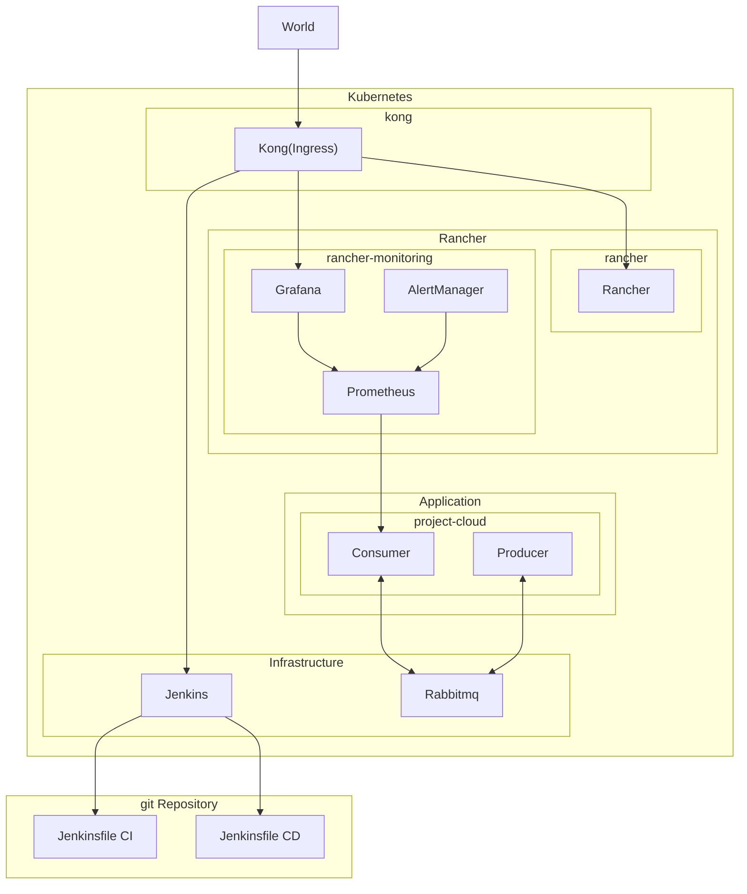

# Introduction
This is a project for a course it's aim is creating a mini jenkins-shop with CI/CD flow of a simple messaging queue application

# Prerequisite
1. A k3s installation with
  1. Ingress as kong
  1. Builtin monitoring stack enabled

# Architecture

