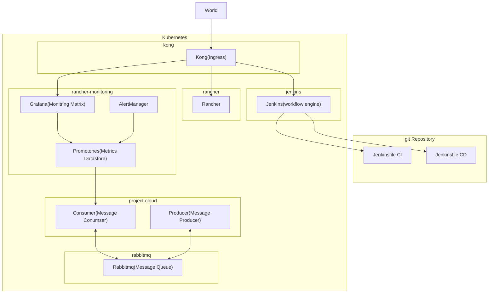

# Introduction
This is a project for a course it's aim is creating a mini jenkins-shop with CI/CD flow of a simple messaging queue application

# Prerequisite
1. A k3s installation with
  1. Ingress as kong
  1. Builtin monitoring stack enabled on k3s

# How to install
1. Import your kubeconfig
1. Run `./run.sh deploy`
1. Add A token from your docker account with the structure
```
USERNAME=<USERNAME>
PASSWORD=<PASSWORD>
```
1. Create a Jenkins-as-a-Code pipeline for the CI aimed at the repo aimed at `Jenkinsfile`
1. Create a Jenkins-as-a-Code pipeline for the CD aimed at the repo aimed at `Jenkinsfile-CD`

# How to run the repo locallay
1. in the repo folder set the `.env` file
```
RABBIT_HOST=localhost
RABBIT_PORT=5672
RABBIT_REPEAT=5
RABBIT_PASSWORD=<rabbit psasword>
RABBIT_USER=user
```
1. port forward the rabbitmq server using the command
```
kubectl port-forward -n rabbitmq rabbitmq 5672:5672
```
1. Set venv and run the script

# Architecture


